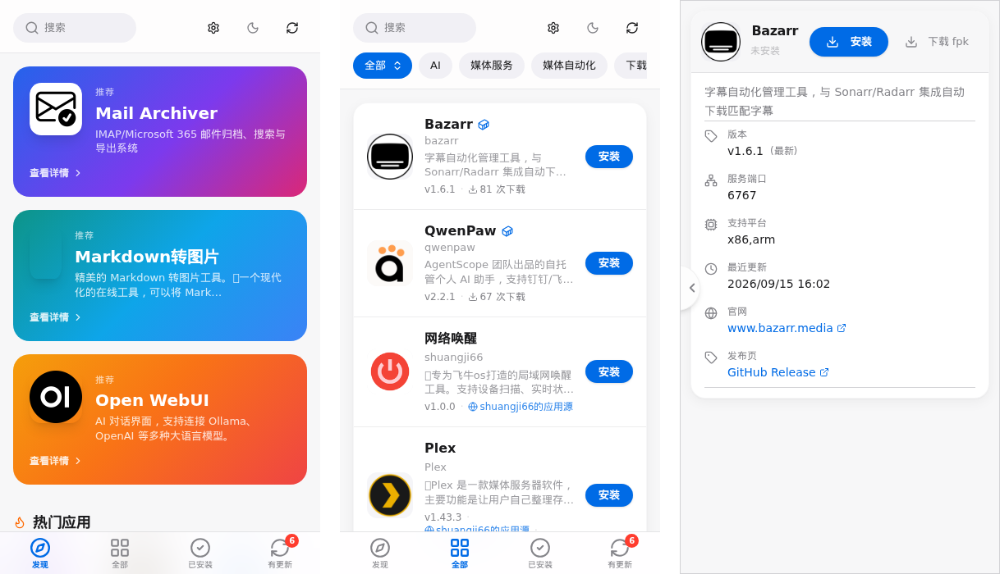
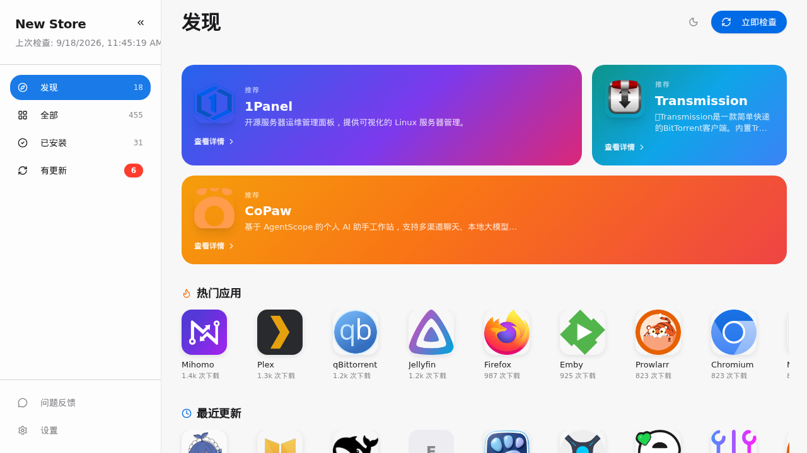
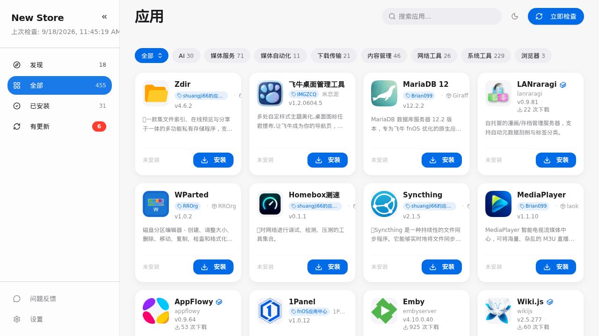
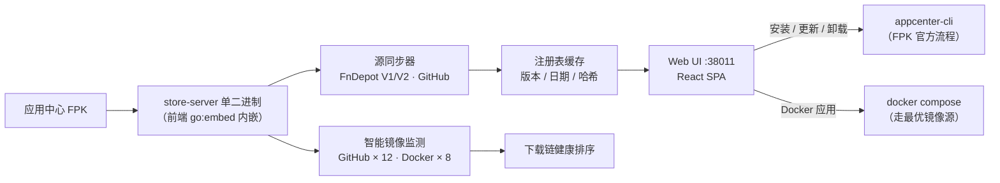

<p align="center">
  <br/>
  <b>New Store for fnOS</b><br/>
  飞牛 NAS 上的第三方应用中心，App Store 式体验，装完只用一个入口访问<br/><br/>
  <a href="../../releases/latest"></a>
  
  
  <a href="LICENSE"></a>
</p>

<p align="center">
  <a href="../../releases/latest">下载 FPK</a> ·
  <a href="https://github.com/conversun/fnos-apps">应用目录上游</a> ·
  <a href="../../issues">反馈问题</a>
</p>

<p align="center">
  <br/>
  <b>移动端三屏</b>：发现 · 全部 · 详情——底部 dock 导航，可嵌入飞牛 App
</p>

本仓库是 fnOS 侧的应用中心本体：一个 Go 单二进制 + 内嵌的 React 前端，以 FPK 装进应用中心后提供独立的 Web 界面。应用内容全部来自社区源（内置目录与可自定义的 FnDepot / GitHub 源），本仓库不打包任何应用本身，上游应用版权归各自作者。

<p align="center">
  <br/>
  <b>「发现」页</b>：随机推荐横幅 · 热门应用 · 最近更新
</p>

<p align="center">
  <br/>
  <b>「全部」页</b>：分类筛选 · 搜索 · 卡片网格（PC 4 列 / 移动端自适配）
</p>

---

## 快速开始

| # | 做什么 | 说明 |
|---|---|---|
| 1 | [下载 FPK](../../releases/latest) | 当前 `1.20.17` · x86 SHA256 `fd0755a46679e8fe28c55aa0d673ed5e9d2ea7413377e922197bf6045dbc588c` |
| 2 | 应用中心 → 手动安装 | 纯 Go 二进制，**无需 Docker / 虚拟机**，无安装向导 |
| 3 | 应用中心「打开」或桌面图标 | 自动指向 `http://<NAS 地址>:38011/` |
| 4 | 点「立即检查」 | 首次同步全部应用源（约 1~3 分钟，视网速），之后每 3 小时自动检查更新 |

> [!NOTE]
> 应用源大多托管在 GitHub，首次全量同步速度取决于网络。内置**智能镜像监测**（见下），国内网络也能自动挑出最快的下载通道；Docker 类应用可叠加本地加速源。

> [!TIP]
> 在飞牛 App（移动端）里也能用：应用是 `micro_app` 嵌入型，支持应用壳的「打开 / 应用设置」直通。

---

## 功能一览

| 能力 | 说明 |
|---|---|
| **App Store 式界面** | 发现（推荐/热门/最近更新）、全部（分类 + 搜索）、已安装、有更新四个分区；PC 侧栏 + 移动端底部 dock 双端布局 |
| **智能镜像监测** | GitHub 17 个代理源 + Docker 8 个镜像源每 5 分钟自动探测，下载链按健康度排序，`auto` 智能模式一次命中最快源，连续 3 败自动持久化切换 |
| **KSpeeder 本地源** | 检测到 iStoreOS 的 iStoreEnhance 本地镜像（`:5443`）时优先走本地拉 Docker 镜像，自签名证书自动放行 |
| **一键安装 / 更新 / 卸载** | FPK 应用走应用中心官方流程（含安装向导），Docker 应用走 compose；SSE 实时进度、可取消、失败可重试 |
| **源管理** | 支持 FnDepot V1 / V2 两种索引格式与 GitHub Release 目录，自定义源增删、单源手动同步、死链 20s 超时 + 6 小时失败记忆 |
| **更新检测** | 版本比较 + 发布日期四级回退（manifest → URL 标签 → Last-Modified → GitHub Atom feed），「有更新」角标与一键更新 |
| **同名去重** | 同名应用按 FPK 的 SHA256 做内容级去重，详情页展示大小 / 哈希对比，避免重复源刷屏 |
| **下载缓存复用** | 安装包按「文件名 + 版本」缓存 24h，向导预取与正式安装复用，不重复下载 |
| **主题与细节** | 亮 / 暗主题、大标题收缩吸顶头、毛玻璃、预览图灯箱、本机安装计数 |

---

## 工作原理



**一句话总结**：应用中心本身只是一个装了 Web 界面的同步器——它把散落在各社区的 FPK / Docker 应用汇成一张 455+ 的目录，安装动作全部交给飞牛平台官方通道执行，所以启停、图标、桌面入口都与原生应用一致。

---

## 默认端口

| 端口 | 位置 | 说明 |
|---|---|---|
| **38011** | NAS | 商店 Web 界面，应用中心「打开」与桌面图标都指向它 |

> [!NOTE]
> 1.19.4 起端口由 `8011` 改为 `38011`（避开常用端口段）；旧版升级后旧地址失效，`manifest` 的 `service_port`、桌面入口与防火墙转发规则随 FPK 安装自动更新。

---

## 卸载与数据

应用中心卸载时有卸载向导，可选**保留 / 清除数据**：

- 保留：目录缓存、源列表、镜像偏好、本机安装计数都在 `@appdata/fnos-apps-store/`，重装即恢复
- 清除：连同上述数据一并删除，重装后从空目录开始

---

## 仓库结构

```
├── cmd/server/           # 服务端入口（LISTEN_ADDR 默认 :38011）
├── internal/
│   ├── api/              # HTTP API / SSE / 智能镜像监测
│   ├── core/             # 注册表、下载器（缓存复用）、去重
│   ├── source/           # FnDepot V1/V2 / GitHub 源解析、日期回退
│   ├── mirror/           # 镜像源健康探测
│   ├── cache/            # 注册表缓存、探测缓存、失败记忆
│   ├── config/           # 用户配置（源 / 镜像偏好）
│   ├── scheduler/        # 定时检查
│   └── platform/         # fnOS 应用中心抽象（appcenter-cli）
├── frontend/             # React 19 + TS + Tailwind + shadcn/ui（Vite）
├── fnos/                 # FPK 包体：manifest / 生命周期 / 桌面入口 / 防火墙规则
├── web/                  # 前端构建产物（go:embed 进二进制）
├── build.sh              # 一键构建：前端 → Go(x86+arm) → fnpack 双平台 FPK
└── releases/             # 各版本源码归档与 FPK 留档
```

---

## 从源码构建

```bash
bash build.sh
# 产出 new-store_<version>_x86.fpk / _arm.fpk（包内 manifest appname 仍为 fnos-apps-store，保升级路径）
```

开发环境：`go run ./cmd/server/`（:38011）+ `cd frontend && npm run dev`（Vite :5173 代理 API）。

---

## 📄 许可证

本项目遵循 [MIT License](LICENSE) 许可证。本仓库仅为飞牛 fnOS 平台的部署封装与应用中心实现，不包含目录中收录的各应用本体，应用版权归各自原作者所有。

---

## 🙏 致谢

- [conversun/fnos-store](https://github.com/conversun/fnos-store) —— 本项目的基础版本
- [conversun/fnos-apps](https://github.com/conversun/fnos-apps) —— 内置应用目录上游
- 各社区应用源作者（[Blue-Mink/FnDepot](https://github.com/Blue-Mink/FnDepot) 等）—— 应用内容
- [RROrg/fn-apps](https://github.com/RROrg/fn-apps) —— FPK 结构与脚本参考
- [飞牛 fnOS](https://www.fnnas.com/) —— 提供友好的 NAS 操作系统体验

---

<div align="center">

**如果觉得好用，顺手点个 ⭐ Star 支持一下！**

Made with ❤️ by [Blue-Mink](https://github.com/Blue-Mink)

</div>
